# Web Visualization Dashboard (Latitude)

For this project, we'll be creating a visualization dashboard website using visualizations we've created in a past project. we'll be plotting weather data.

In building this dashboard, we'll create individual pages for each plot and a means by which we can navigate between them. These pages will contain the visualizations and their corresponding explanations. We'll also have a landing page, a page where we can see a comparison of all of the plots, and another page where we can view the data used to build them. We will also use media query to make our page responseive.

This website is consist of 7 pages total, including:

## "Landing" page

This page contains:

* An explanation of the project.
* Links to each visualizations page. There should be a sidebar containing preview images of each plot, and clicking an image should take the user to that visualization.

### Landing Page - Large Screen

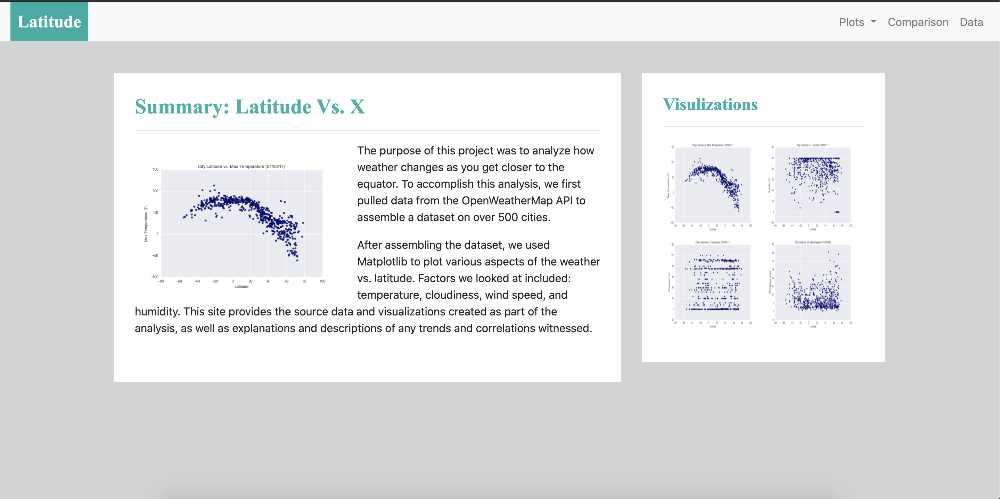

 

### Landing Page - Small Screen

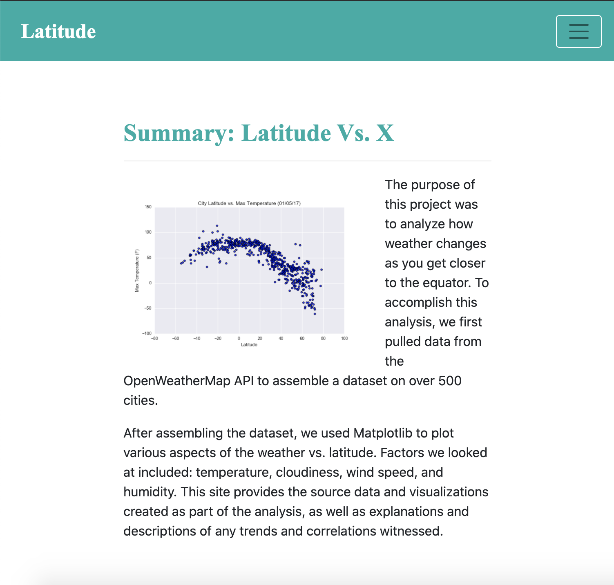

# "Visualization" pages

There will be 4 vizualization pages. Each page contains:

* A descriptive title and heading tag.
* The plot/visualization itself for the selected comparison.
* A paragraph describing the plot and its significance.

### Max Temperature - Large Screen

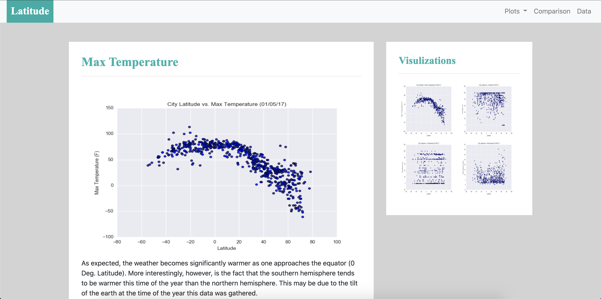

 

### Max Temperature - Small Screen

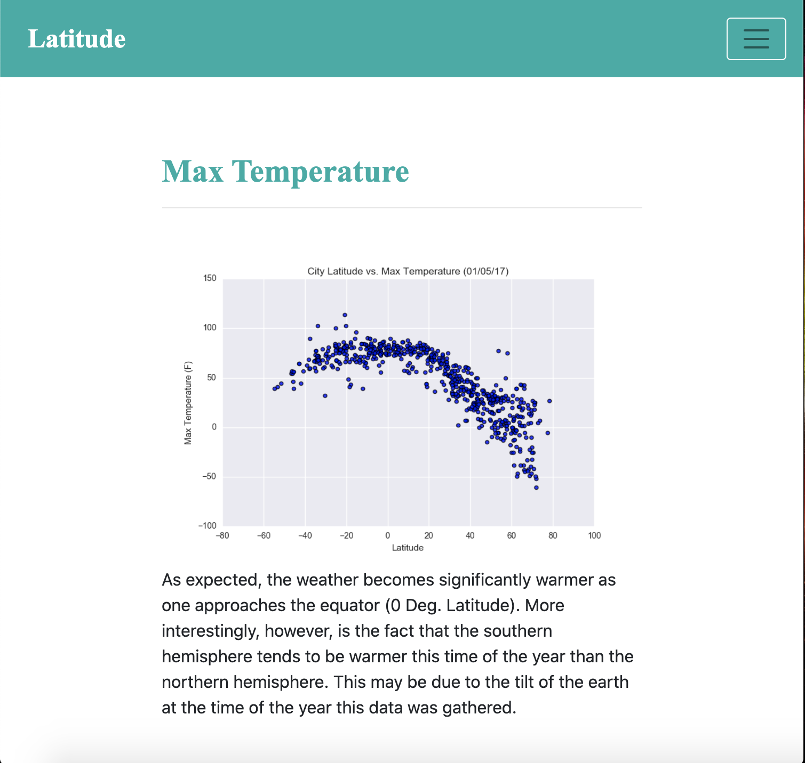

### Humidity - Large Screen

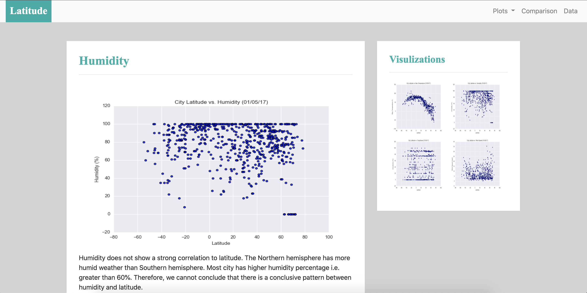

 

### Humidity - Small Screen

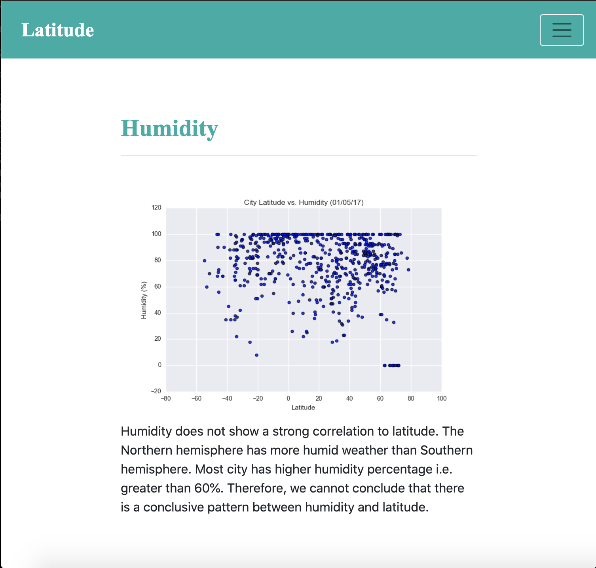

### Cloudiness - Large Screen

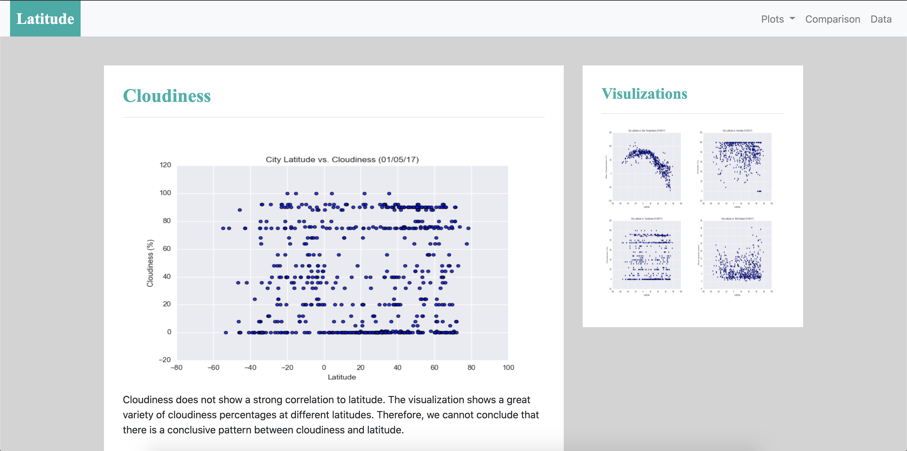

 

### Cloudiness - Small Screen

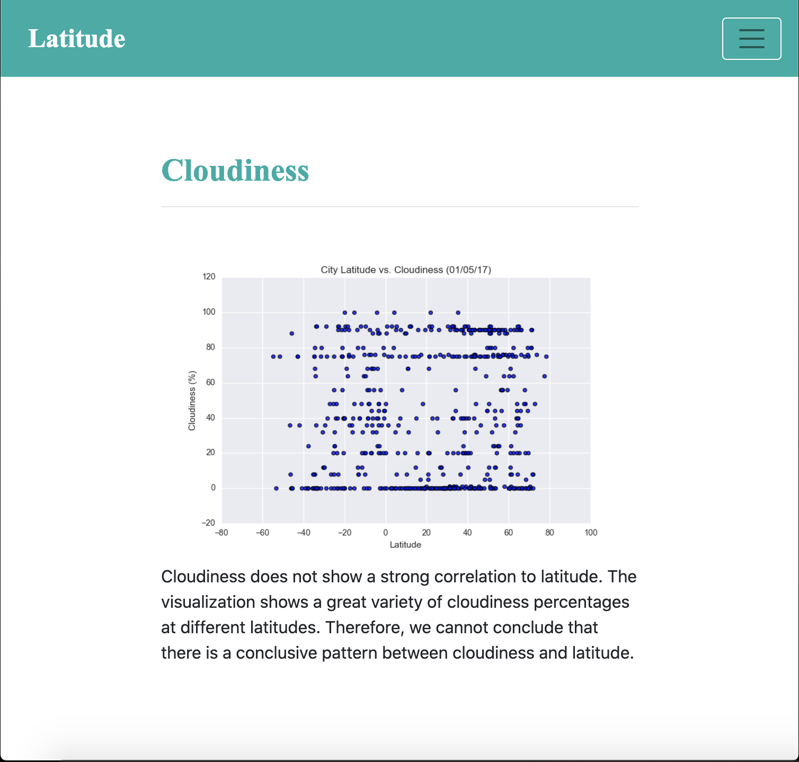

### Wind Speed - Large Screen

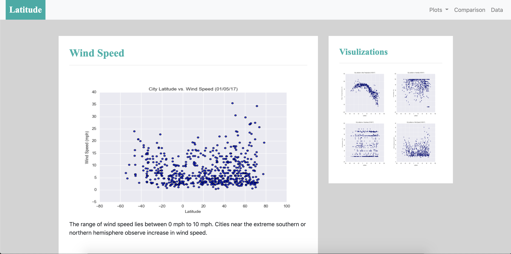

 

### Wind Speed - Small Screen

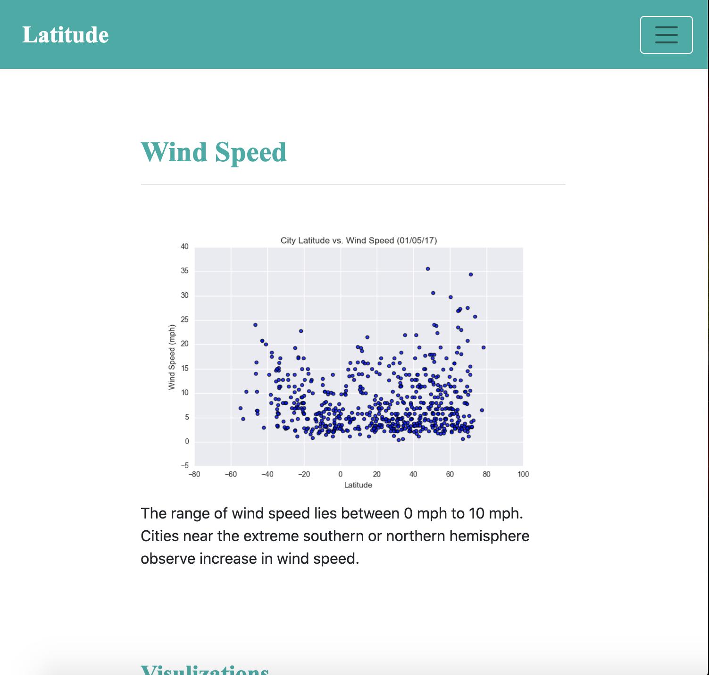

# "Comparisons" page

This page have below specifications:

* Contains all of the visualizations on the same page so we can easily visually compare them.
* Uses a Bootstrap grid for the visualizations.
    * The grid has two visualizations across on screens medium and larger, and 1 across on extra-small and small screens.
    

### Comparison - Large Screen

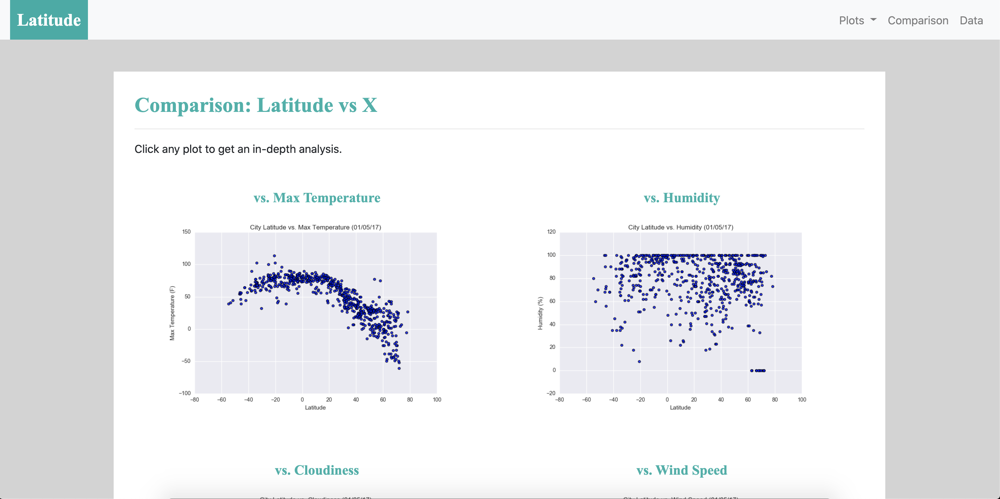

 

### Comparison - Small Screen

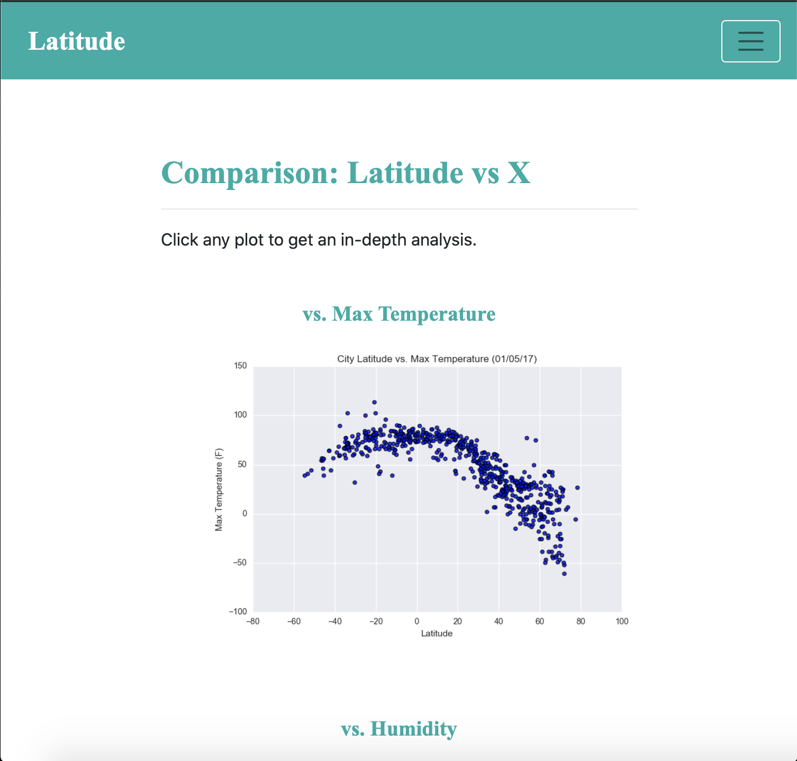

# "Data" page

This page have below specifications:

* Displays a responsive table containing the data used in the visualizations.
* The table has a bootstrap table component. 

### Data - Large Screen

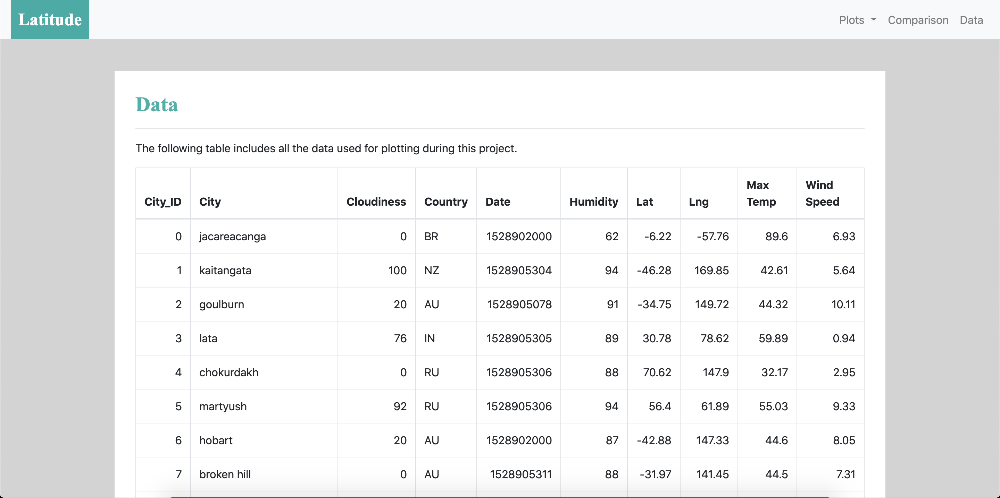

 

### Data - Small Screen

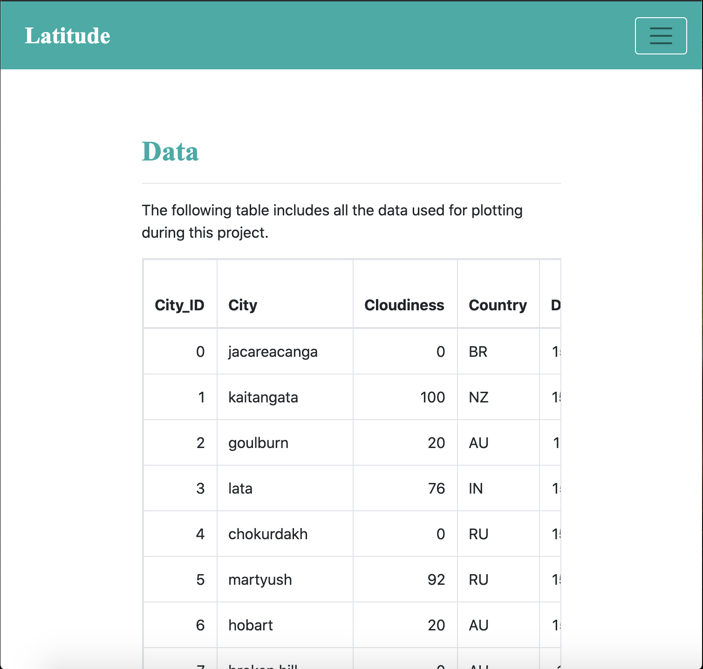

The website, at the top of every page, have a navigation menu that:

* Has the name of the site on the left of the nav which allows users to return to the landing page from any page.
* Contains a dropdown menu on the right of the navbar named "Plots" that provides a link to each individual visualization page.
* Provides two more text links on the right: "Comparisons," which links to the comparisons page, and "Data," which links to the data page.
* Is responsive (using media queries). 

I have also deployed the website to the GitHub pages. Feel free to click the below link to visit the page:

GitHub Pages link : 
